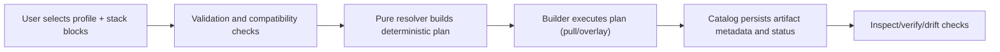

# Stacksmith

**Hardware-aware ML container build manager.**

Stacksmith is a CLI tool that resolves, builds/pulls, tags, and catalogs optimized inference container images for multiple hardware profiles. It produces deterministic, reproducible container builds with full provenance tracking.

## Architecture-First Overview

Stacksmith is a deterministic build planner/executor for ML containers. The core behavior is:

- Users express desired application behavior through **stack blocks**.
- Profiles capture **host facts + restrictions** (not feature wishes).
- Resolver logic derives a concrete, compatible build plan.
- Builders execute the plan and catalog stores provenance + lifecycle state.

### Product Contract (blocks-first)

- **Intent surface:** `stack.blocks` (ordered, composable).
- **Host model:** profile host/runtime facts + policy restrictions.
- **System outputs:** selected base, compatible dependency set, warnings/errors, decision trace.
- **Determinism rule:** same profile + stack (+ variants + rules/template version) => same fingerprint/tag.

### End-to-End Flow



### Major Runtime Paths

1. **Authoring path** (YAML or Web create APIs): profiles/stacks/blocks are defined and validated.
2. **Planning path** (`plan`): resolver computes base choice, steps, fingerprint, rationale.
3. **Execution path** (`ensure`): builder runs the plan, captures manifest/SBOM, writes artifact state.
4. **Governance path** (`compatibility`, `verify`, drift): safety checks before/after build.

### Core Design Boundaries

- Resolver is **pure** and side-effect free.
- Builders and runtime layers are **impure** (Docker/buildx/network/fs).
- Catalog is the persistence boundary for artifact lifecycle and search.
- Web and CLI are orchestration surfaces over the same domain/resolver/builder core.

### Where Major Pieces Live

- `packages/stacksmith/src/stacksmith/domain/`: canonical models, enums, hashing/fingerprinting, errors.
- `packages/stacksmith/src/stacksmith/resolvers/`: compatibility, rules, scoring, resolver decision logic.
- `packages/stacksmith/src/stacksmith/builders/` + `packages/stacksmith/src/stacksmith/runtime/`: plan execution and runtime integrations.
- `packages/stacksmith/src/stacksmith/catalog/`: SQLite models/store/migrations and lifecycle queries.
- `packages/stacksmith/src/stacksmith/web/routes/`: API contract surface (`create`, `compatibility`, `plan`, `ensure`, `settings`, etc).
- `apps/web/src/views/`: user-facing create/build/catalog workflows.

### What Stacksmith Is Not

- Not a workload orchestrator (no scheduler/k8s deployment controller).
- Not a general dependency SAT solver.
- Not legal advice (license scanning is advisory policy tooling).

## Quick Start

### Prerequisites

- Python 3.10+
- Docker with buildx
- NVIDIA Container Runtime (for GPU profiles)

### Install

```bash
python -m venv .venv
source .venv/bin/activate
pip install -e ".[dev]"
```

### Check your environment

```bash
stacksmith doctor
```

### List available profiles and stacks

```bash
stacksmith list profiles
stacksmith list stacks
stacksmith list blocks
```

### Generate a plan

```bash
stacksmith plan --profile dgx_spark --stack diffusion_fastapi
```

Add `--json` for machine-readable output:

```bash
stacksmith plan --profile dgx_spark --stack diffusion_fastapi --json
```

### Build/pull the image

```bash
stacksmith ensure --profile dgx_spark --stack diffusion_fastapi
```

Force rebuild:

```bash
stacksmith ensure --profile dgx_spark --stack diffusion_fastapi --rebuild
```

### Inspect an image

```bash
stacksmith inspect local/stacksmith:diffusion_fastapi-dgx_spark-cuda12.5-python_api-fastapi-<hash>
```

### Search the catalog

```bash
stacksmith catalog search --profile dgx_spark
stacksmith catalog search --stack diffusion_fastapi --status built
```

### Prune failed/stale artifacts

```bash
stacksmith catalog prune
```

## Core Architecture Map

This section is the high-level oversight view for engineering focus.

### 1) Contracts and creation

- `packages/stacksmith/src/stacksmith/web/schemas.py`: API DTO contracts (create/update/preview/system).
- `packages/stacksmith/src/stacksmith/web/routes/create.py`: create + dry-run + compose endpoints, normalization, and metric emission.
- `packages/stacksmith/src/stacksmith/web/routes/meta.py`: create-contract metadata (`/api/meta/create-contracts`) and schema-version guidance.

Focus area: keep contract semantics stable while evolving behavior behind versioned metadata.

### 2) Host detection and profile modeling

- `packages/stacksmith/src/stacksmith/web/services/host_detection.py`: server-host probing and confidence annotations.
- `packages/stacksmith/src/stacksmith/domain/models.py`: profile shape (facts, restrictions, and derived capability metadata).
- `packages/stacksmith/src/stacksmith/config.py`: profile loading and validation boundary.

Focus area: profiles should remain host/restriction descriptors, not software-intent declarations.

### 3) Stack/block composition and intent

- `packages/stacksmith/src/stacksmith/domain/composition.py`: stack_recipe + ordered blocks -> concrete stack merge.
- `packages/stacksmith/src/stacksmith/config.py`: `load_stack()` composes recipe stacks for runtime usage.
- `packages/stacksmith/src/stacksmith/web/routes/stacks.py`: stack API access and raw spec retrieval.

Focus area: preserve authored recipe intent while still supporting resolved/composed preview.

### 4) Compatibility and resolver

- `packages/stacksmith/src/stacksmith/resolvers/compatibility.py`: structured compatibility evaluation + issue taxonomy + decision trace.
- `packages/stacksmith/src/stacksmith/resolvers/rules.py`: cross-field checks and compatibility guards.
- `packages/stacksmith/src/stacksmith/resolvers/rule_catalog.py` + `specs/rules/compatibility_rules.yaml`: catalog-driven rule system.
- `packages/stacksmith/src/stacksmith/resolvers/scoring.py` + `packages/stacksmith/src/stacksmith/resolvers/base_catalog.py`: base candidate selection logic.
- `packages/stacksmith/src/stacksmith/resolvers/resolver.py`: pure plan resolution and rationale assembly.

Focus area: continue moving behavior from ad hoc checks to structured rule/catalog evaluation.

### 5) Build execution and artifact lifecycle

- `packages/stacksmith/src/stacksmith/builders/`: overlay/pull execution strategies.
- `packages/stacksmith/src/stacksmith/runtime/`: Docker/buildx interactions, manifest and SBOM capture.
- `packages/stacksmith/src/stacksmith/catalog/store.py`: artifact persistence and query surface.
- `packages/stacksmith/src/stacksmith/catalog/migrations.py`: schema evolution safety.

Focus area: execution remains deterministic and auditable; lifecycle transitions stay explicit.

### 6) Experience surfaces

- `apps/web/src/views/ProfilesView.vue`: profile authoring flow (modal-first).
- `apps/web/src/views/StacksView.vue`: stack recipe authoring flow (modal-first).
- `apps/web/src/views/BlocksView.vue`: block authoring flow (modal-first).
- `apps/web/src/views/CatalogView.vue`: active build trigger + compatibility display.
- `apps/web/src/router.ts`: route topology and primary navigation.

Focus area: align UX with architecture contract (blocks-first intent, explainability-forward decisions).

## Adding Profiles

Profiles are host descriptors. They should capture:
- detected host/runtime facts,
- compatibility restrictions/policy constraints,
- minimal overrides when needed.

Profiles are not the primary place to declare desired software functionality. That intent should be captured through stack block selection.

### Guided setup in Web UI (recommended)

Open `Create Profile` and click **Guided Setup** to launch the modal wizard.

- The wizard runs host detection against the **Stacksmith server host** (not the browser machine).
- Detection is best-effort and always overrideable before writing.
- Detection now follows a chain-first flow: bootstrap invariants, execution-context discovery, OS-family/capability-gated probes, then catalog reconciliation and quality scoring.
- Required fields are marked in the create flows and validated before write.
- The flow still uses dry-run + confirm-write so profile creation remains explicit and deterministic.
- If metadata fails to load, first verify backend availability with `curl http://127.0.0.1:8765/api/health`.
- For full triage, run `python tools/diagnose_metadata.py` to classify failures (`backend_unreachable`, `endpoint_500`, etc.).

API equivalents:

- `GET /api/system/detection-hints` for server-host prefill hints.
- `GET /api/meta/create-contracts` for required-field and constraint metadata.

Hardware detection coverage details and investigation checklist live in `docs/hardware_detection_matrix.md`.
Probe modularity and extension points are implemented in `packages/stacksmith/src/stacksmith/web/services/host_detection.py` (orchestrator) and `packages/stacksmith/src/stacksmith/web/services/host_detection_probes.py` (probe registry + probe implementations).

Create a YAML file in `specs/profiles/`:

```yaml
schema_version: 1
id: my_workstation
display_name: "My Workstation"
arch: amd64
os: linux
container_runtime: nvidia
cuda:
  major: 12
  minor: 4
  variant: "cuda12.4"
gpu:
  vendor: nvidia
  family: "ampere"
constraints:
  disallow:
    serve: []
  require:
    env: [NVIDIA_VISIBLE_DEVICES]
base_candidates:
  - name: "nvcr.io/nvidia/pytorch"
    tags: ["24.06-py3"]
    score_bias: 100
defaults:
  python: "3.10"
  workdir: "/workspace"
```

Then verify: `stacksmith list profiles` should show it.

## Adding Stacks

Stacks are the primary user intent surface. In blocks-first mode, select and order blocks to express what the application needs, then let resolver logic derive compatible implementation details for the detected host.

Create a YAML file in `specs/stacks/`:

```yaml
schema_version: 1
kind: stack_recipe
id: my_service
display_name: "My Service"
blocks: [fastapi, vllm]
build_strategy: overlay
components:
  base_role: pytorch
files:
  copy:
    - { src: "services/my_service/", dst: "/app" }
```

For block-first authoring, `blocks` are the primary intent surface. Runtime shape (deps/env/ports/entrypoint) is inferred by deterministic composition of selected blocks.

## Composable Blocks (New)

You can now define reusable stack blocks and compose them into a recipe stack.

### 1) Define reusable blocks in `specs/blocks/`

```yaml
kind: block
schema_version: 1
id: fastapi
display_name: "FastAPI API layer"
block_kind: api
components:
  pip:
    - { name: "fastapi", version: "==0.115.*" }
    - { name: "uvicorn", version: "[standard]==0.30.*" }
ports: [8000]
```

### 2) Create a recipe stack in `specs/stacks/`

```yaml
kind: stack_recipe
schema_version: 1
id: llm_fastapi_blocks
display_name: "LLM + FastAPI (composed blocks)"
blocks: [fastapi, triton]
build_strategy: overlay
components:
  base_role: pytorch  # optional override
```

### Merge and precedence rules

- Recipe-owned identity fields are authoritative: `id`, `display_name`.
- Block order matters: later blocks override earlier blocks for composable scalars.
- Recipe overrides apply last.
- `env` entries are deduped by key; later values win.
- `pip` dependencies are deduped by package name; incompatible constraints fail fast.
- V1 does not support transitive block includes.

Inspect or render a resolved stack:

```bash
stacksmith inspect-block --id fastapi
stacksmith compose --stack llm_fastapi_blocks --json
```

### Web UI/API for Blocks and Recipes

The web app now supports block authoring and recipe stack composition.

- Create block UI: `/blocks?create=1` (legacy `/create/block` redirects here)
- Create stack UI (block-only recipe flow): `/stacks?create=1`
- API endpoints:
  - `GET /api/blocks`
  - `GET /api/blocks/{id}`
  - `POST /api/blocks`
  - `POST /api/blocks/dry-run`
  - `POST /api/stacks` (block-only recipe payload)
  - `POST /api/stacks/compose` (recipe compose preview)

Compose preview response shape:

```json
{
  "valid": true,
  "errors": [],
  "yaml": "kind: stack\n...",
  "resolved_spec": { "kind": "stack", "id": "..." },
  "dependency_conflicts": [],
  "tuple_conflicts": [],
  "runtime_conflicts": []
}
```

### Block preset taxonomy policy

Block setup is intentionally opinionated for ML inference workflows. Presets are categorized to keep discovery predictable while still allowing full manual edits after autofill.

- Baseline and inference-first categories:
  - `llm_serving`
  - `diffusion`
  - `vision_inference`
  - `speech_audio`
  - `data_rag`
- Platform and delivery categories:
  - `agentic_workflows`
  - `inference_optimization`
  - `api_app`
  - `observability`
  - `infra`
  - `robotics_edge` (pilot)
  - `training` (advanced/non-default surface)

Category and preset IDs must stay stable once published; new entries should be additive and validated via tests.

### Preset rollout and quality gates

For each preset expansion phase:

1. Catalog validation passes (unique IDs, valid categories, valid dependency/port/env shapes).
2. Wizard renders categories/presets correctly and supports filter + manual fallback.
3. Representative block create + dry-run checks pass for each new category.
4. Regression checks confirm existing stacks and recipes still load/compose.

Robotics/edge coverage is intentionally a pilot surface. Expand only after usage and maintenance criteria are met.

### Dependency conflict visibility roadmap

`/api/stacks/compose` now surfaces `dependency_conflicts` in compose preview responses as advisory metadata:

- `warning`: overlapping intent (for example, pinned vs latest).
- `error`: incompatible constraints.

This supports a follow-up UX step where users can explicitly choose which dependency intent to keep before final composition/build.

### Architecture-aware tuple layer

Stacksmith now includes a tuple decision layer that resolves hardware/runtime facts into a supported implementation path:

- Input facts: `arch`, `os_family_id`, `os_version_id`, `container_runtime`, `gpu_vendor_id`, optional `gpu_family_id` and CUDA/driver windows.
- Source of truth: `specs/rules/tuple_catalog.yaml`.
- Outputs: structured `tuple_decision` in compatibility preview and plan preview, plus tuple labels on built artifacts.

Rollout control:

- Set `STACKSMITH_TUPLE_LAYER_MODE` to one of `off`, `shadow`, `warn`, `enforce`.
- Default is `enforce`.
- Recommended rollout: `shadow` (parity telemetry) -> `warn` (operator visibility) -> `enforce` (hard gate).

Tuple provenance:

- Resolver writes `stacksmith.tuple_id`, `stacksmith.tuple_status`, and `stacksmith.tuple_mode` labels.
- Manifest capture persists these fields for repro and verification workflows.

### Python wheelhouse install modes

For architecture-sensitive Python packages (for example `flash-attn`), Stacksmith supports explicit pip source policy at stack/block level:

- `index` (default): install from standard pip indexes.
- `wheelhouse_prefer`: install using `--find-links <path>` with index fallback.
- `wheelhouse_only`: install using `--no-index --find-links <path>` and fail if wheel artifacts are missing.

`pip_wheelhouse_path` must be a workspace-relative path and is required for wheelhouse modes.

Operational guidance:

1. Start with canary stacks using `wheelhouse_prefer`.
2. Promote stable tuples (arch/cuda/torch/package) to `wheelhouse_only`.
3. Keep strict `requires` metadata on sensitive presets so incompatible hosts fail at compatibility preview, not during build.

### npm lock install modes

Stacksmith can enforce npm lockfile policy at stack/block level via `npm_install_mode`:

- `spec` (default): install from declared `components.npm` dependencies.
- `lock_prefer`: if a copied lockfile exists (`package-lock.json`, `pnpm-lock.yaml`, `yarn.lock`), install from lockfile; otherwise fall back to declared deps.
- `lock_only`: require one copied lockfile and install from lockfile only.

For lock modes, include the lockfile in `files.copy` so it exists in the build context.

### apt pin install modes

Stacksmith can enforce apt version pin policy via `apt_install_mode`:

- `repo` (default): install from repository metadata; optional `apt_constraints` are applied when provided.
- `pin_prefer`: same behavior as `repo`, but explicitly documents intent to pin where possible.
- `pin_only`: require `apt_constraints` for every package listed in `components.apt`.

`apt_constraints` entries are appended directly to package names in apt install commands (for example `curl: \"=8.5.0-1ubuntu1\"`).

## Drift Detection

Stacksmith detects **drift** when a previously built image no longer matches the current plan. An artifact is marked stale if any of these conditions are true:

1. **Fingerprint mismatch** -- the embedded fingerprint label differs from the expected value.
2. **Base digest changed** -- the upstream base image has been updated.
3. **Template hash changed** -- the Dockerfile template was modified.
4. **Stack schema version changed** -- the stack spec schema was bumped.
5. **Profile schema version changed** -- the profile schema was bumped.
6. **Builder version changed** -- the Stacksmith version used to build differs from the current version.

When drift is detected during `ensure`, the old artifact is marked `stale` with a specific reason, and a rebuild is triggered. Use `--immutable` to fail instead of rebuilding (important for CI).

```bash
stacksmith ensure -p dgx_spark -s llm_vllm --immutable
stacksmith catalog stale
```

## Artifact Lifecycle

Artifacts pass through these statuses: `planned` -> `building` -> `built` (or `failed`). A `built` artifact can transition to `stale` when drift is detected.

Pruning:

```bash
stacksmith prune --stale         # Remove stale artifacts + images
stacksmith prune --failed        # Remove failed artifacts
stacksmith prune --all-unused    # Remove all non-newest artifacts
stacksmith prune --all-unused --force  # Include newest stable
```

The newest `built` artifact per (profile, stack, variant) is **protected** from pruning unless `--force` is used.

Disk usage reporting:

```bash
stacksmith catalog disk-usage
```

## Manifest & Reproducible Builds

After every successful build, Stacksmith captures a **resolved manifest** containing the exact installed versions:

- `pip freeze` output (pinned versions)
- `dpkg-query` package list (Debian-based images)
- `npm ls --depth=0` package snapshot (when npm is available)
- Selected package policy modes (`pip_install_mode`, `npm_install_mode`, `apt_install_mode`)
- Python version
- Environment variables and entrypoint

View a manifest:

```bash
stacksmith manifest <tag>
```

Reproduce a build from its manifest with pinned dependencies:

```bash
stacksmith repro <artifact-id>
```

The repro command creates a synthetic stack spec with exact versions, producing a **distinct fingerprint** to avoid tag collision with the original.

## SBOM Export

Optionally export a Software Bill of Materials:

```bash
stacksmith sbom <tag> --format spdx-json
stacksmith sbom <tag> --format cyclonedx-json
```

Stacksmith tries `docker sbom` first, then falls back to [Syft](https://github.com/anchore/syft). SBOM generation is auxiliary -- failures never affect artifact status.

## Variant System

Stacks can declare variants for controlled matrix expansion:

```yaml
variants:
  xformers:
    type: bool
    default: false
  precision:
    type: enum
    options: [fp16, bf16, fp32]
    default: bf16
```

Build with variant overrides:

```bash
stacksmith ensure -p dgx_spark -s llm_vllm --var xformers=true --var precision=fp16
```

Variant values are included in the fingerprint (sorted, stringified), so different variant combinations produce different tags. Unknown variant keys are rejected.

## Registry Policies

Configure trusted registries in `~/.config/stacksmith/config.yaml`:

```yaml
registry:
  allow:
    - nvcr.io
    - ghcr.io
  deny:
    - docker.io/library/randomuser
```

The resolver validates base image candidates against this policy. Denied registries are rejected. If an allow list is configured, only listed registries are permitted.

If a base image is referenced without a digest, Stacksmith warns that the build may not be reproducible.

## How Fingerprinting Works

Stacksmith generates a deterministic SHA-256 fingerprint from:

- Profile ID, architecture, CUDA variant
- Base image name and digest
- Stack spec: resolved build strategy and composed runtime shape
- All pip dependencies (sorted by name, versions normalized)
- All npm dependencies (sorted by name/manager/scope, versions normalized)
- All apt packages (sorted alphabetically)
- Apt constraints and install modes (`apt_install_mode`, `npm_install_mode`, `pip_install_mode`)
- Environment variables (sorted alphabetically)
- Ports (sorted)
- Copy items (sorted by source path)
- Dockerfile template hash and template version
- Builder version (`stacksmith.__version__`)
- Variant overrides (sorted keys, stringified values)

The image tag encodes this fingerprint:

```
local/stacksmith:{stack}-{profile}-{cuda}-{serve}-{api}-{first_12_chars_of_hash}
```

Same inputs always produce the same tag. If any input changes, the tag changes and a rebuild is triggered.

Additionally, every image gets OCI labels embedding the full fingerprint, profile, stack, and base digest. The `ensure` command checks both tag existence and label fingerprint match, so manually retagged images are detected as stale.

## How to Interpret License Warnings

Stacksmith includes a best-effort SPDX license mapping in `licenses/spdx_map.yaml`.

Severity levels:
- **ok**: Permissive license (MIT, Apache-2.0, BSD). No action needed.
- **review**: Copyleft or ambiguous license. Review before redistribution.
- **restricted**: Proprietary EULA or redistribution-limited. Build blocked unless `--allow-restricted` is passed.

**This is not legal advice.** Consult your legal team for redistribution decisions.

## Troubleshooting

Run `stacksmith doctor` to diagnose issues:

- **Docker daemon not reachable**: Start Docker or check socket permissions.
- **Buildx not available**: Install Docker Buildx plugin.
- **nvidia-container-runtime not found**: Install the NVIDIA Container Toolkit.
- **GPU not visible**: Check NVIDIA drivers and `NVIDIA_VISIBLE_DEVICES`.
- **NGC_API_KEY not set**: Export `NGC_API_KEY` for pulling NGC container images.
- **Architecture mismatch**: Your Docker daemon arch differs from the profile. Cross-platform builds via QEMU will be slow.

## Development

```bash
# Run tests
python -m pytest tests/ -v

# Run linter
ruff check packages/stacksmith/src/stacksmith tests/

# Run type checker
mypy packages/stacksmith/src/stacksmith
```

If frontend unit-test tooling is not configured in your environment, use this manual verification checklist:

1. Create a block via `/blocks?create=1` (dry-run + save).
2. Create a recipe stack via `/stacks?create=1` with selected/reordered blocks.
3. Confirm compose preview renders resolved YAML/JSON.
4. Confirm profile create flow opens from `/profiles`.

## Deprecation Policy

Stacksmith follows a two-step deprecation process for user-facing commands and endpoints:

1. **Deprecation window (at least one release):**
   - Old surfaces remain functional.
   - CLI/runtime warnings indicate the preferred replacement.
2. **Removal window:**
   - Deprecated surfaces are removed after the warning period.
   - Release notes list exact replacements.

Current deprecations:

- `stacksmith profiles list` -> `stacksmith list profiles`
- `stacksmith stacks list` -> `stacksmith list stacks`
- `stacksmith blocks list` -> `stacksmith list blocks`
- `stacksmith catalog build` -> `stacksmith ensure`
- `POST /api/system/detection-hints/remote` -> use `GET /api/system/detection-hints` on the server host

## Project Structure

```
stacksmith/
  packages/stacksmith/src/stacksmith/  # Python package
    cli.py                             # Typer CLI application
    config.py                          # YAML loaders and app config
    logging.py                         # Rich console + file logging
    domain/                            # Pydantic models, enums, hashing, errors, drift, manifest, repro
    resolvers/                         # Pure resolver, rules, scoring, validators
    builders/                          # Overlay builder, pull builder, plan executor
    runtime/                           # Docker SDK client, buildx CLI, manifest capture, SBOM export
    catalog/                           # SQLite persistence via SQLAlchemy, migrations
    licenses/                          # SPDX mapping, policy engine, scanner (incl. SBOM)
    hooks/                             # Post-build validation hooks (import smoke, CUDA check)
  specs/profiles/                      # Hardware profile YAML files
  specs/stacks/                        # Stack spec YAML files
  specs/blocks/                        # Reusable stack block YAML files
  specs/templates/                     # Jinja2 Dockerfile and requirements templates
  specs/rules/                         # Compatibility and tuple catalogs
  generated/                           # Generated/derived artifacts (kept out of authored source trees)
  apps/api/                            # API runtime surface wrappers
  apps/web/                            # Vue web UI application
  apps/cli/                            # Optional CLI surface docs/wrappers (implementation stays in package)
  docs/                                # Architecture and contributor docs
  tests/                               # Backend, contract, and integration tests
  ops/scripts/         # Operational shell scripts (service/dev/test helpers)
  ops/systemd/         # Deployment unit files
  tools/               # Compatibility wrappers and developer utilities
```

## Repository Layout Boundaries

- `packages/stacksmith/src/stacksmith` is the only canonical Python source root.
- `apps` contains user-facing runtime surfaces (`api`, `web`, and optional thin `cli` surface wrappers/docs).
- `specs` contains authored profile/stack/block/rule/template data.
- `generated` is reserved for generated or derived artifacts, not canonical authored specs.
- `apps/web` contains only browser client source and its tests/build tooling.
- `ops/scripts` contains canonical operational shell entrypoints; `tools` keeps compatibility wrappers and developer utilities.
- `ops/systemd` contains service deployment artifacts and should not contain runtime source code.
- `docs` is the documentation source of truth for architecture and contributor onboarding.
- `tests` remains top-level for backend, contract, and migration regression coverage; frontend tests live under `apps/web/tests`.

For full placement rules and rationale, see `docs/repository_layout.md`.

## Keeping the Workspace Clean

- Generated and local-only artifacts are intentionally ignored (virtualenvs, caches, node modules, logs, local runtime state, generated outputs).
- Primary noisy paths are `apps/web/node_modules`, `build`, `dist`, `generated`, and `.stacksmith`.
- If local clutter accumulates, it is safe to remove generated artifacts and reinstall:

```bash
rm -rf build dist generated/* apps/web/node_modules .stacksmith
pip install -e ".[dev]"
cd apps/web && npm ci
```
