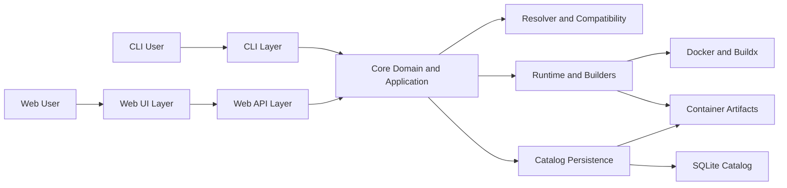

# System Architecture

## System Overview

Stacksmith is a layered architecture where CLI and Web API act as orchestration surfaces over a shared domain core, resolver engine, runtime executors, and catalog persistence.

## Architectural Boundaries

## Presentation and Orchestration

- CLI (`packages/stacksmith/src/stacksmith/cli.py`) and API routes (`packages/stacksmith/src/stacksmith/web/routes/*`) accept user input, apply transport-level validation and UX concerns, and call shared core behavior.
- Web UI (`apps/web/src`) renders workflows and uses API contracts, without embedding core resolver logic.

## Core Domain and Application

- Domain models, contracts, and invariant logic live in `packages/stacksmith/src/stacksmith/domain`.
- Multi-step create flows and related orchestration live in `packages/stacksmith/src/stacksmith/application`.
- Ensure pipeline behavior is centralized in `packages/stacksmith/src/stacksmith/domain/ensure.py`.

## Resolution and Compatibility

- Compatibility/rule evaluation and plan derivation live in `packages/stacksmith/src/stacksmith/resolvers`.
- Resolver is designed to be side-effect free.

## Execution and Persistence

- Runtime/build operations live in `packages/stacksmith/src/stacksmith/runtime` and `packages/stacksmith/src/stacksmith/builders`.
- Artifact lifecycle and query storage are in `packages/stacksmith/src/stacksmith/catalog`.
- Web jobs add API-facing async tracking in `packages/stacksmith/src/stacksmith/web/jobs`.

## End-to-End Lifecycle

## Cross-Cutting Concerns

## Determinism and Provenance

- Stable fingerprint generation ties plan inputs to artifact identity.
- OCI labels and manifests carry provenance metadata.

## Security and Safety

- Token-gated API mutation, admin token boundaries, and path traversal guards.
- Compatibility and policy checks before expensive runtime operations.

## Reliability

- SQLite-backed catalog and job records.
- Controlled status transitions for artifact and job lifecycles.

## Observability

- Structured command/API responses.
- Job logs and server-sent events for long-running execution visibility.

## File and Module Map

- CLI orchestration: `packages/stacksmith/src/stacksmith/cli.py`
- API app and middleware: `packages/stacksmith/src/stacksmith/web/app.py`
- API contracts: `packages/stacksmith/src/stacksmith/web/schemas.py`
- Shared create flows: `packages/stacksmith/src/stacksmith/application/create_flows.py`
- Ensure pipeline: `packages/stacksmith/src/stacksmith/domain/ensure.py`
- Resolver core: `packages/stacksmith/src/stacksmith/resolvers/resolver.py`
- Runtime executors: `packages/stacksmith/src/stacksmith/runtime`, `packages/stacksmith/src/stacksmith/builders`
- Catalog persistence: `packages/stacksmith/src/stacksmith/catalog/store.py`
- Web UI app: `apps/web/src`

## Key Files to Read Next

- `packages/stacksmith/src/stacksmith/domain/models.py`
- `packages/stacksmith/src/stacksmith/resolvers/compatibility.py`
- `packages/stacksmith/src/stacksmith/builders/plan_executor.py`
- `packages/stacksmith/src/stacksmith/web/routes/jobs.py`
- `apps/web/src/api/client.ts`

## Common Modification Scenarios

- Adding a new capability: update schemas -> core models -> resolver rules -> UI/API exposure -> tests.
- Changing build behavior: update plan execution/runtime modules while preserving resolver purity.
- Extending artifact metadata: update catalog schema/store and ensure manifest/provenance consistency.
