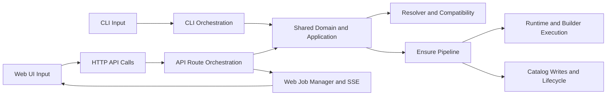

# Cross-Layer Interactions

## Why This Matters

StackWarden intentionally separates concerns so multiple surfaces (CLI and API/UI) can drive the same core behavior without semantic drift. Understanding handoffs between layers is critical for safe changes.

## Layer Interaction Model

## CLI -> Core

The CLI translates command-line inputs into calls to shared domain/application modules. It should remain an orchestration shell and avoid embedding duplicate planning or compatibility logic.

Examples:

- `plan` and `check` map to resolver/compatibility pathways.
- `ensure` maps to the shared ensure pipeline.
- `catalog` and inspection commands map to catalog/runtime access surfaces.

## UI -> API -> Core

The Web UI performs transport-safe interactions through typed API clients; API routes then call shared core logic.

Responsibilities by layer:

- UI: UX state, form flows, error display, token/session usage.
- API: contract validation, auth, HTTP status mapping, async job orchestration.
- Core: domain invariants, deterministic planning, execution semantics, artifact lifecycle.

## Shared Ensure Path

A key architectural anchor is the shared ensure pipeline in `packages/stackwarden/src/stackwarden/domain/ensure.py`, used by:

- CLI `ensure` path
- API job runners for web-triggered ensure operations

This preserves behavior parity for build/pull and lifecycle transitions across surfaces.

## Data and Contract Boundaries

## Input Contracts

- CLI arguments and options are validated at command entry and mapped to core inputs.
- API payloads use Pydantic DTO contracts (`packages/stackwarden/src/stackwarden/web/schemas.py`) and normalized error response formats.

## Persistence Contracts

- Catalog store (`packages/stackwarden/src/stackwarden/catalog/store.py`) is the persistent artifact source of truth.
- Web job store tracks asynchronous API job metadata and status for UI consumption.

## Output Contracts

- CLI supports machine-readable output modes for automation.
- API exposes stable response structures consumed by frontend endpoint wrappers.

## Invariant Enforcement Points

- Resolver compatibility rules enforce planning constraints before runtime.
- Ensure lifecycle controls enforce status transitions and drift/rebuild behavior.
- Validation utilities in web and CLI paths enforce transport/input safety.

## Coupling Rules for Contributors

- Add business logic in shared core modules, not duplicated in CLI routes or web routes.
- Keep UI logic focused on presentation and interaction, not domain decision-making.
- Introduce new persistence writes through domain/service boundaries with tests.

## Failure and Recovery Patterns

- Early validation failure: compatibility or contract errors returned before runtime effects.
- Runtime failure: artifact/job status transition to failed states with preserved diagnostics.
- Drift detection: built artifacts can transition to stale and trigger rebuild logic depending on flags.

## Key Files to Read Next

- `packages/stackwarden/src/stackwarden/domain/ensure.py`
- `packages/stackwarden/src/stackwarden/application/create_flows.py`
- `packages/stackwarden/src/stackwarden/web/routes/jobs.py`
- `packages/stackwarden/src/stackwarden/catalog/store.py`
- `apps/web/src/api/endpoints.ts`

## Common Modification Scenarios

- New cross-surface feature: define shared core behavior first, then expose via CLI and API/UI.
- Contract evolution: version DTO shape carefully and update frontend endpoint adapters and tests.
- New lifecycle state: add domain transition logic, catalog persistence handling, and UI rendering semantics.
